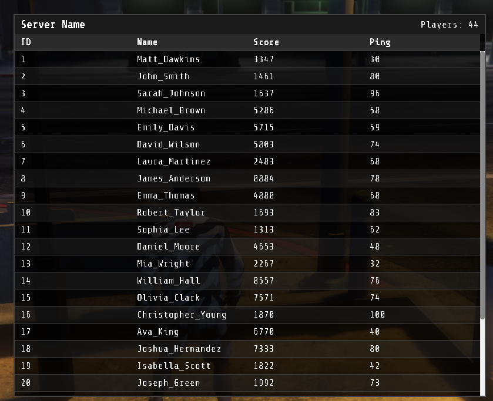
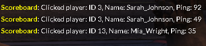

# SAM scoreboard
SA-MP scoreboard for FiveM, you can adjust it anywhere.

<details>
  <summary>Screenshot 1</summary>
  
</details>

<details>
  <summary>Screenshot 2</summary>
  
</details>


# Usage
It's plug and play, just  make sure to ensure it on your server.cfg.

## Callback

Every functions trigger server event called 

```lua
AddEventHandler('SAM-scoreboard:Server:onScoreboardPlayerClicked', function(clickedPlayerId, clickedPlayerName, clickedPlayerPing)end)
```

You can listen the event in any other resource by adding this on your any resource files (make sure you put the SAM-scoreboard in top of your resources that you want to listen to)
```lua
RegisterNetEvent('SAM-scoreboard:Server:Custom:onScoreboardPlayerClicked')
AddEventHandler('SAM-scoreboard:Server:Custom:onScoreboardPlayerClicked', function(clickedPlayerId, clickedPlayerName, clickedPlayerPing)
    -- Handle the event here
    print("Received player click event in Example resource. Player ID: " .. clickedPlayerId .. ", Name: " .. clickedPlayerName .. ", Ping: " .. clickedPlayerPing)
end)
```

## TODO
Configuration for the job, factions or gangs (it will give the player specific color based on their jobs or factions)

Feel free to open an issue, and contribute are welcomed.
